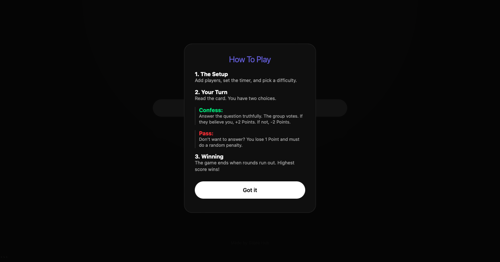
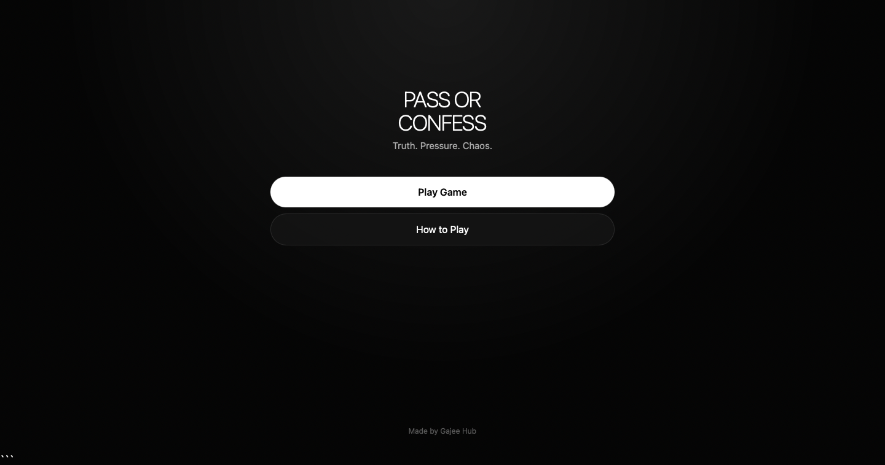

# PASS OR CONFESS

  
  

A fast-paced social party game where players must choose between telling the truth or taking the consequences.

Built entirely with HTML, CSS, and JavaScript, PASS OR CONFESS combines party-game chaos, social deduction, confessions, penalties, power cards, and competitive scoring into one mobile-friendly experience.

---

## Features

### Multiple Question Categories

* Deep Questions
* Confessions
* Friends Edition
* Spicy Questions
* Chaos Cards

### Competitive Scoring System

Players earn and lose points based on their decisions and group votes.

* Tell the truth and gain points
* Get caught lying and lose points
* Pass a question and accept a penalty
* Build streaks for bonus rewards

### Chaos Events

Random events can completely change the game.

* Double Points Round
* Triple or Nothing
* Score Swap
* Reverse Rankings
* Everyone Loses Points

### Power Cards

Special abilities that players can collect and use.

* Double Next Truth
* Immunity
* Steal Points
* Force Another Player To Answer

### Statistics Tracking

The game automatically saves:

* Games Played
* Highest Score
* Longest Streak
* Personal Records

### Mobile Friendly

Designed for pass-the-phone gameplay:

* Responsive Layout
* Smooth Animations
* Touch Friendly Controls
* No Installation Required

---

## How To Play

### 1. Create Your Game

Choose:

* Number of Rounds
* Timer Settings
* Game Mode

### 2. Add Players

Add between 2 and 20 players.

Enter everyone's name before starting.

### 3. Start Playing

Pass the phone to the active player.

Only that player should view the question.

### 4. Choose

#### Confess

Answer honestly.

The group votes on whether they believe you.

#### Pass

Skip the question and accept a penalty.

### 5. Survive The Chaos

Random events and power cards can completely change the leaderboard.

### 6. Win

When all rounds are complete, the player with the highest score wins.

---

## Built With

* HTML5
* CSS3
* Vanilla JavaScript
* Local Storage API
* Web Audio API

No frameworks.
No backend.
No dependencies.

---

## Why This Project Exists

PASS OR CONFESS was created to make social gatherings more fun, chaotic, and memorable using only a single phone and a browser.

It combines party games, social deduction, confessions, and competitive scoring into one experience.

---

## Creator

Created by Gajee Hub

---

## License

Personal and educational use.
